# Enterprise Architecture Workshop: Secure Application Design

## 1. General Description
This repository contains the implementation of the **Enterprise Architecture Workshop: Secure Application Design** lab using two decoupled servers on AWS:

- **Server 1 (Apache):** serves the asynchronous web client (HTML + CSS + JavaScript).
- **Server 2 (Spring Boot):** exposes REST services for user registration and authentication.

The objective was to build a security-focused solution: TLS usage, secure client-server communication, and hashed credential handling.

## 2. Solution Architecture

### 2.1 Component View
- **Web Client (Apache):**
  - Registration and login forms.
  - Asynchronous backend API consumption (`fetch`).
- **Spring Boot Backend (REST API):**
  - Endpoints `/users` and `/users/login`.
  - Password hashing logic with SHA-256.
  - MongoDB persistence.
- **AWS Infrastructure (EC2):**
  - Instance for Apache.
  - Instance for Spring Boot.

### 2.2 Logical Diagram
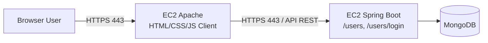

## 3. Implemented Security

### 3.1 TLS on Both Services
- TLS was configured for:
  - Client download from Apache.
  - REST API exposure in Spring Boot.
- Certificates were used to protect traffic confidentiality and integrity.

### 3.2 Password Hashing
- In the user service, passwords are not stored in plain text.
- Deterministic SHA-256 hashing is applied before persistence.
- During login, the hash is computed again and compared against the stored value.

## 4. Project Structure
```text
Apache/
  index.html
  styles.css
  script.js
Spring/
  pom.xml
  src/main/java/... (controllers, service, model, repository)
  src/main/resources/application.properties
images/
  (deployment, TLS, and testing evidence)
```

## 5. Deployment Procedure (AWS)


### 5.1 Apache Server (Frontend)
1. Create an EC2 instance for Apache.
2. Install and enable Apache (`httpd`).
3. Copy files from `Apache/` to the public directory (`/var/www/html`).
4. Open ports 80 and 443 in the Security Group.
5. Generate/install TLS certificate (Let's Encrypt + Certbot).
6. Validate HTTPS access to the frontend.
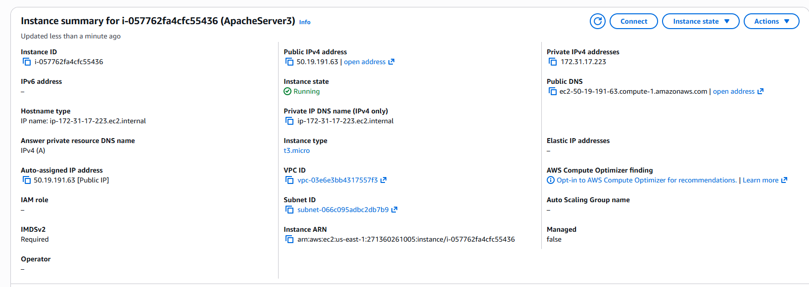
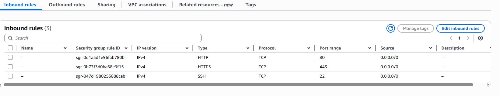

### 5.2 Spring Server (Backend)
1. Create an EC2 instance for Spring.
2. Install Java 17 and Maven.
3. Clone the repository and enter the `Spring/` directory.
4. Define minimum environment variables:
   - `SERVER_PORT` 
   - `MONGODB_URI`
   - `SSL_ENABLED`
   - `SSL_KEY_STORE`, `SSL_KEY_STORE_PASSWORD`, `SSL_KEY_ALIAS`
5. Package and run:
   - `mvn clean package`
   - `java -jar target/SecureSpring2-1.0-SNAPSHOT.jar`
6. Open required ports (443 and/or configured port) in the Security Group.
7. Validate REST endpoints over HTTPS.
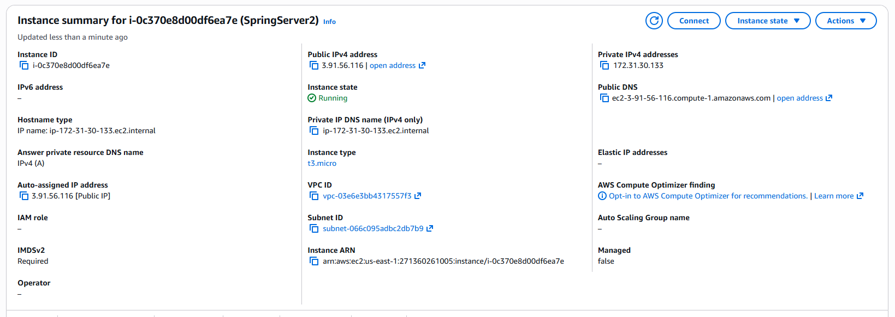
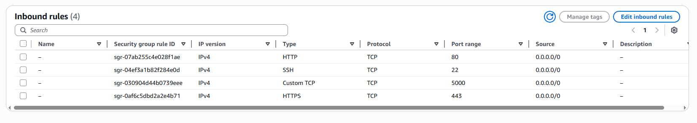


### 5.4 TLS Configuration in Spring
- Spring is prepared for TLS via `application.properties`:
  - `server.ssl.enabled`
  - `server.ssl.key-store-type=PKCS12`
  - `server.ssl.key-store`
  - `server.ssl.key-store-password`
  - `server.ssl.key-alias`
- The backend can run SSL with a `.p12` keystore.

## 6. Evidence

### 6.1 Architecture and Operation
- Base architecture:   
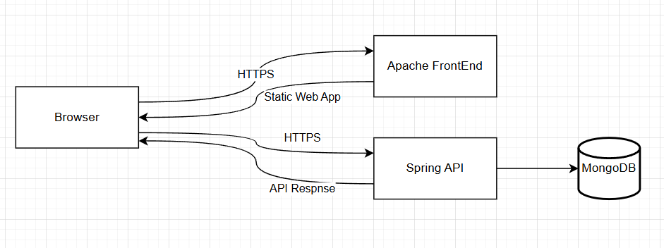
- Working frontend (HTML/CSS/JS): 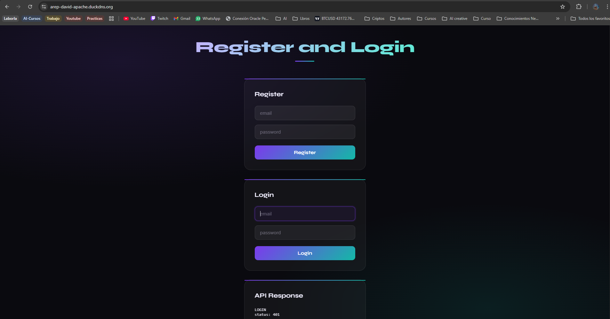
- Running Spring Web application: 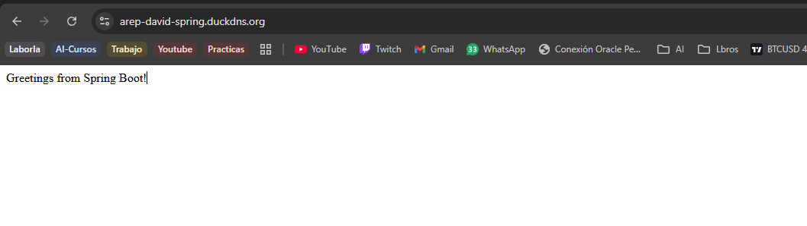

### 6.2 TLS and Port Evidence
- TLS certificate on frontend: 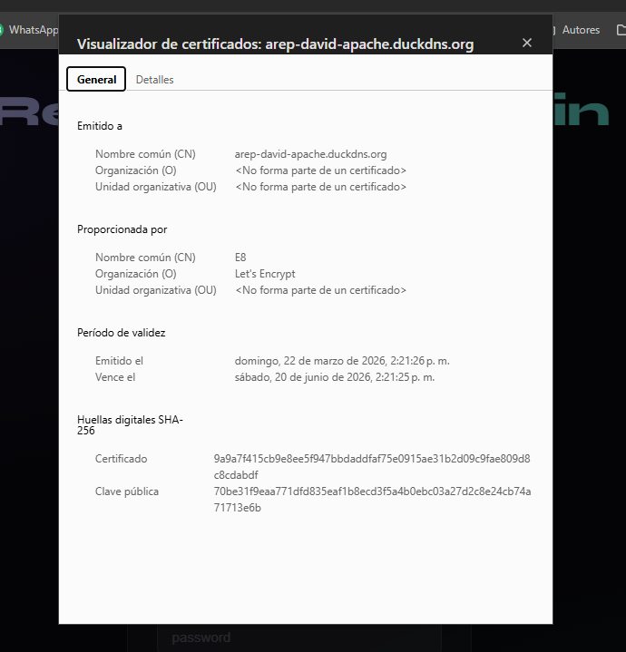
- TLS certificate on Spring: 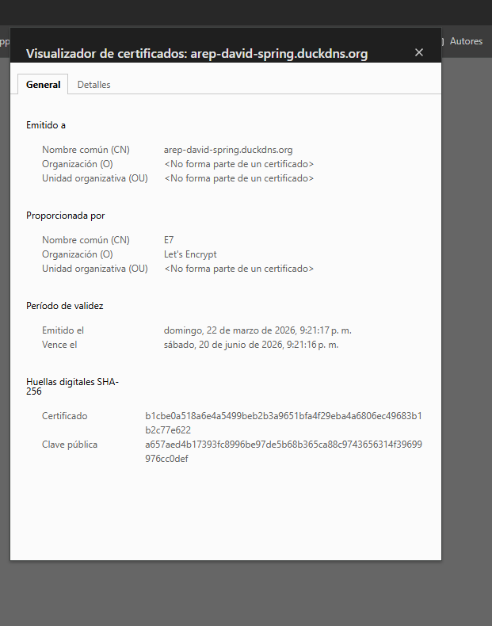
- Apache status on ports 80/443: 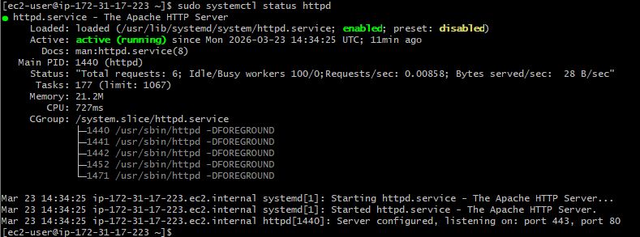

### 6.3 EC2 Deployment Evidence
- Spring running on EC2 instance: 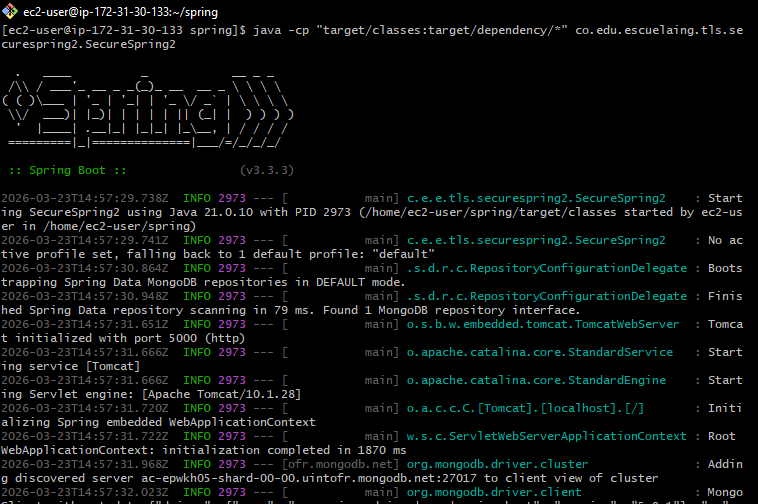

## 7. Endpoints API

### 7.1 User Registration
- **POST** `/users`
- Body JSON:
```json
{
  "email": "usuario@correo.com",
  "password": "clave123"
}
```
- Expected responses:
  - `201 Created`: user created.
  - `409 Conflict`: user already exists.

### 7.2 Login
- **POST** `/users/login`
- Body JSON:
```json
{
  "email": "usuario@correo.com",
  "password": "clave123"
}
```
- Expected responses:
  - `200 OK`: successful authentication.
  - `401 Unauthorized`: invalid credentials.

## 8 Strengths
- Decoupled architecture (frontend/backend on independent servers).
- TLS encryption implementation for secure transport.
- Password persistence with hash (without plain-text storage).
- Asynchronous client to improve user experience and response times.
- Separating frontend and backend makes it easier to scale each layer horizontally.
- Using environment variables enables secure per-environment configuration.


## 9. Demonstration Video (Final Deliverable)
[Video demonstration](https://youtu.be/LNma_gHhyp0)

---
